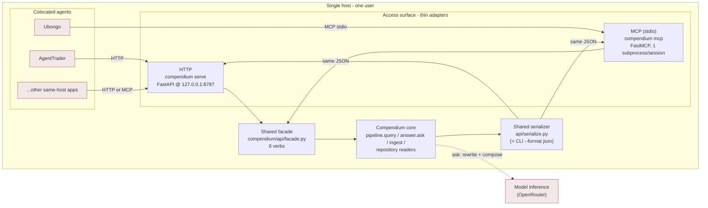
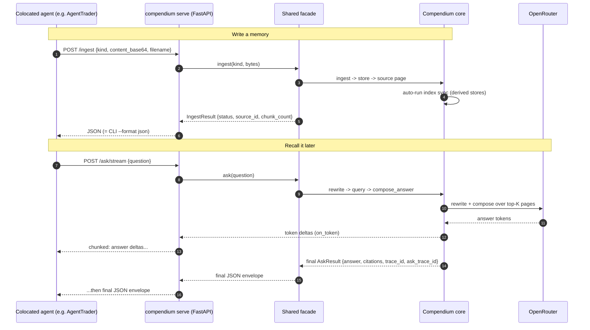
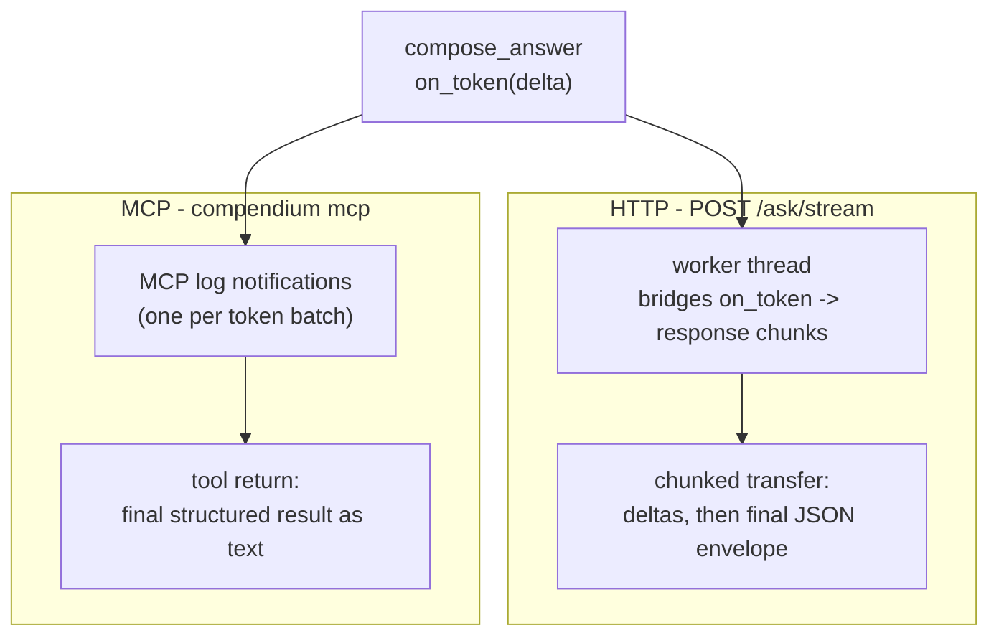

# Agents — Compendium as Long-Term Memory

How **colocated agents** (the curator's other same-host programs — e.g.
AgentTrader, Ubongo) use Compendium as shared long-term memory. v0.2 Phase 7,
ADR-011. The agents are external systems to Compendium; they reach it through the
**access surface**, never by reading the vault or PostgreSQL directly.

The honest constraint: **callers are colocated**. The surface binds loopback
(`127.0.0.1`) or runs over stdio; there is no network to authenticate against, so
there is no auth. Network exposure, token auth, and TLS are deferred to v0.3+.
See [../operations/access-surface.md](../operations/access-surface.md).

## 1. Who calls Compendium (agent context)

Both transports are **thin adapters over one shared facade**. The facade returns
the existing dataclasses; both transports serialize through one helper, so the
surface JSON is byte-for-byte the CLI's `--format json` and cannot drift. Six
verbs only — `query`, `ask`, `ingest`, `page_get`, `page_list`, `index_status`.
Curator/ops verbs (`curate`, `trace`, `page promote`, `reindex`, `graph …`,
`synth`) stay CLI-only.

## 2. An agent using Compendium as memory (sequence)

A typical loop: an agent ingests something it learned, then later asks Compendium
to recall it. Shown over HTTP; MCP is the same facade with stdio framing.

## 3. Streaming `ask` across the two transports

`ask` is the one verb that streams. The Phase 6 `on_token` callback is bridged to
each transport differently, but the final structured result is identical.

## Notes

- **The agents are clients, not part of Compendium.** They appear as the
  *Colocated agents* external system in the [system context](c4-context.md) and
  [container](c4-containers.md) views. This document zooms into the boundary
  between them and the access-surface container.
- **One facade, two adapters (ADR-011).** Keeping the verbs, dataclasses, and
  serializer shared is what lets agents trust that the HTTP/MCP JSON matches the
  CLI exactly. Adding a verb means adding it to the facade once, not per
  transport.
- **MCP specifics.** FastMCP over stdio, one subprocess per agent session; tool
  input schemas are derived from the verb signatures; each blocking facade call
  is offloaded via `anyio.to_thread.run_sync` so the event loop is never blocked.
- **Why no auth.** Single user, single host, loopback/stdio only. The moment the
  bind leaves `127.0.0.1` this assumption breaks — which is exactly why network
  exposure is a deliberate v0.3 decision, not a flag to flip casually.
- **Compendium as shared memory.** A single Compendium instance is the shared
  memory namespace for the curator's agents; multi-tenancy / per-agent namespaces
  are not in v0.2. Operator guide: [../operations/access-surface.md](../operations/access-surface.md).
