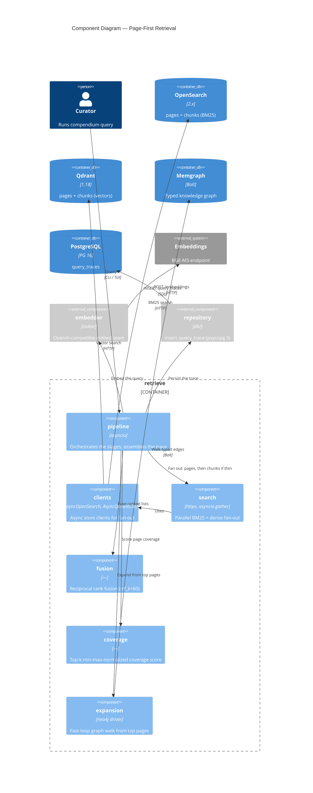

# C4 Level 3 — Components of Retrieval

A zoom into the `retrieve` component (the [main component diagram](c4-components.md) box),
the page-first pipeline that is Compendium's core bet (ADR-003). Each component maps to a
module under [compendium/retrieve/](../../compendium/retrieve/), with the embedder and the
trace repository as collaborators from neighbouring packages.

## Notes

- **`pipeline.run` is async and dependency-injectable.** Clients and the embedder are
  parameters with live defaults, which is how the golden tests drive it hermetically with the
  stub embedder.
- **Only the fan-out is async.** Embedding is one synchronous call before the fan-out; the
  trace write is one synchronous `psycopg 3` call after. The parallelism that matters is
  across the two stores (`asyncio.gather` over the OpenSearch and Qdrant clients), per the
  CLAUDE.md rule that the DB layer stays synchronous.
- **Coverage gates the fallback.** `coverage` normalizes the fused page scores to 0–1 and
  averages the top `k` (default 7); if that mean is below `page_coverage_threshold` (0.5),
  `pipeline` runs a second fan-out over the `chunks` index/collection, attaches chunk
  citations, and records a `low_coverage` gap.
- **Expansion is the fast loop** (ADR-009). It walks Memgraph from the fused top pages along
  typed edges and logs the result into `query_traces.graph_expansion`; it never changes the
  final ranking in v0.1. The slow counterpart lives in the `curate` package, which mines
  these traces and graph signals into a curation queue.
- **The trace is the contract for replay.** Everything the ranking depended on is persisted,
  so `compendium trace replay` can re-run a past query and diff the final ranking.
