# C4 Level 3 — Components of the Compendium Application

The internal modules of the Compendium Python application. Each maps to a
sub-package under `compendium/`.

```mermaid
C4Component
  title Component Diagram — Compendium Application

  Person(curator, "Curator / Reader", "One user")
  ContainerDb(vault, "Markdown vault", "Files", "Canonical wiki pages")
  ContainerDb(postgres, "PostgreSQL", "PG 16", "Operational record")
  ContainerDb(opensearch, "OpenSearch", "2.x", "Lexical index")
  ContainerDb(qdrant, "Qdrant", "—", "Vector index")
  ContainerDb(memgraph, "Memgraph", "—", "Knowledge graph")
  System_Ext(inference, "Model inference", "LLM + embeddings")

  Container_Boundary(app, "Compendium application") {
    Component(cli, "CLI", "argparse", "Parses commands, calls a module, prints the rendered result")
    Component(tui, "TUI", "Textual", "Keyboard ops console; screens over a DataScreen load helper + data provider")
    Component(render, "Presentation", "stdlib", "Result objects → text/json; scalar formatters shared by CLI + TUI")
    Component(config, "Configuration", "pyyaml, dotenv", "Loads and validates settings and secrets")
    Component(ingest, "Ingestion", "pymupdf, ebooklib, trafilatura", "Adapters, inspection, chunking, pipeline")
    Component(wiki, "Wiki generation", "openai SDK", "Source pages, concept/topic synthesis, lint, vault writer")
    Component(index, "Index sync", "opensearch-py, qdrant-client", "StoreProjector per store; drains the sync queue")
    Component(retrieve, "Retrieval", "httpx, asyncio", "Page-first hybrid query pipeline with chunk fallback")
    Component(graph, "Graph", "neo4j Bolt driver", "Structural index: typed nodes and edges")
    Component(curate, "Curation", "—", "Signal lifecycle, slow-loop signals, synth-from-signal")
    Component(trace, "Telemetry", "difflib", "Query traces, revision diffs, replay, promotions")
    Component(db, "Database access", "psycopg 3", "Raw-SQL repository over PostgreSQL")
  }

  Rel(curator, cli, "Runs commands")
  Rel(curator, tui, "Operates the console")
  Rel(cli, render, "Renders the result (text/json)")
  Rel(tui, render, "Formats cells/summaries")

  Rel(cli, ingest, "Ingest")
  Rel(cli, wiki, "Generate pages, lint, synth")
  Rel(cli, index, "Reindex")
  Rel(cli, retrieve, "Query")
  Rel(cli, graph, "Rebuild, status, link")
  Rel(cli, curate, "Run, list, synth")
  Rel(cli, trace, "Inspect, replay, promote")
  Rel(tui, retrieve, "Query / synth / browse, via the data provider")

  Rel(cli, config, "Loads at startup")
  Rel(ingest, db, "Stores sources and chunks")
  Rel(wiki, db, "Reads chunks; writes pages and revisions")
  Rel(wiki, vault, "Writes Markdown pages")
  Rel(wiki, inference, "Synthesizes concept/topic pages")
  Rel(index, db, "Reads pages and chunks")
  Rel(index, vault, "Reads page bodies")
  Rel(index, inference, "Embeds text")
  Rel(index, opensearch, "Writes the lexical index")
  Rel(index, qdrant, "Writes the vector index")
  Rel(index, memgraph, "Projects nodes/edges", "Bolt")
  Rel(retrieve, opensearch, "Lexical search")
  Rel(retrieve, qdrant, "Vector search")
  Rel(retrieve, graph, "Graph expansion")
  Rel(retrieve, db, "Writes query traces")
  Rel(graph, memgraph, "Reads and writes", "Bolt")
  Rel(graph, db, "Reads pages and chunks")
  Rel(curate, graph, "Reads expansion signals")
  Rel(curate, wiki, "Synthesizes from a signal")
  Rel(curate, db, "Reads/writes curation signals")
  Rel(trace, db, "Reads traces and revisions")

  UpdateLayoutConfig($c4ShapeInRow="3", $c4BoundaryInRow="1")
```

## Notes

- Every component reaches PostgreSQL through **`db`**, the raw-SQL repository
  — no ORM. PostgreSQL is the system of record; the other stores are written
  by `index` and `graph` and read by `retrieve`.
- **`wiki`** owns the canonical artifact: it generates deterministic `source`
  pages, synthesizes `concept`/`topic` pages via the LLM, lints frontmatter,
  and writes pages into the vault with a revision per write.
- **Presentation is one seam.** `render` (`compendium/cli/render.py`) turns
  module result objects into text or JSON and owns the shared scalar formatters
  (coverage, timestamps, the fallback flag); both the `cli` and the `tui`
  consume it, so a format lives in exactly one place.
- **Each front-end is thin.** `cli` is parse → call a module → `render` → print;
  `tui` screens subclass `DataScreen`, whose `run_threaded` owns the
  off-UI-thread load-then-marshal cycle, over the `tui/data.py` provider.
- **Internal seams worth naming.** Within `index`, a `StoreProjector` per derived
  store (`index/projectors.py`) owns mapping-and-writing one entity, dispatched
  by `index_kind`. Within `curate`, `lifecycle.py` owns the signal state machine
  (`open → in_progress → addressed`) and the promote/address ordering. Within
  `graph`, `graph_connection()` is the Bolt-driver lifecycle, the analog of
  `db.connection`.
- **Every component is implemented** and maps to a sub-package under
  `compendium/`: `cli` (+ `cli/render.py`), `tui`, `config`, `ingest`, `wiki`,
  `index`, `retrieve`, `graph`, `curate`, `trace`, `db`. `graph` speaks Bolt to
  Memgraph via the official `neo4j` driver with raw Cypher (no OGM).
- The two loops that make the system compound — the fast per-query graph walk
  (in `retrieve`, calling `graph`) and the slow curation loop (in `curate`) —
  are detailed in [c4-components-retrieval.md](c4-components-retrieval.md) and
  [c4-dynamic-query.md](c4-dynamic-query.md).
