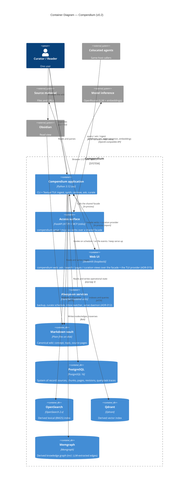

# C4 Level 2 — Containers

The runnable and storage units that make up Compendium (v0.2).

## Notes

- **The Compendium application** is one Python package with multiple entrypoints
  (the CLI `python -m compendium`, the Textual TUI). Ingestion runs synchronously
  in-process, no job queue.
- **The access surface (v0.2, ADR-011)** is a thin adapter, not a second brain:
  `compendium serve` (FastAPI on `127.0.0.1`) and `compendium mcp` (MCP stdio)
  both call **one shared facade** (`compendium/api/facade.py`) over the same
  `pipeline.query` / `answer.ask` / `ingest` / repository readers the CLI uses,
  and serialize through the same helper — so the surface JSON is byte-for-byte
  the CLI's `--format json`. Six verbs: `query`, `ask`, `ingest`, `page_get`,
  `page_list`, `index_status`.
- **Always-on services (v0.2, ADR-012)** are user-level launchd/systemd units
  that run the application on a cadence or on events: the daily backup, the
  curation slow loop, the inbox file-watcher, and the access-surface daemon. See
  [c4-deployment.md](c4-deployment.md).
- **The Markdown vault is canonical** (ADR-001); PostgreSQL is the system of
  record (ADR-004); OpenSearch, Qdrant, and Memgraph are derived and rebuildable
  (ADR-005). The graph now also holds LLM-extracted `RELATED_TO` /
  `PREREQUISITE_FOR` edges with provenance (ADR-010), rebuilt on the next
  `curate run`.
