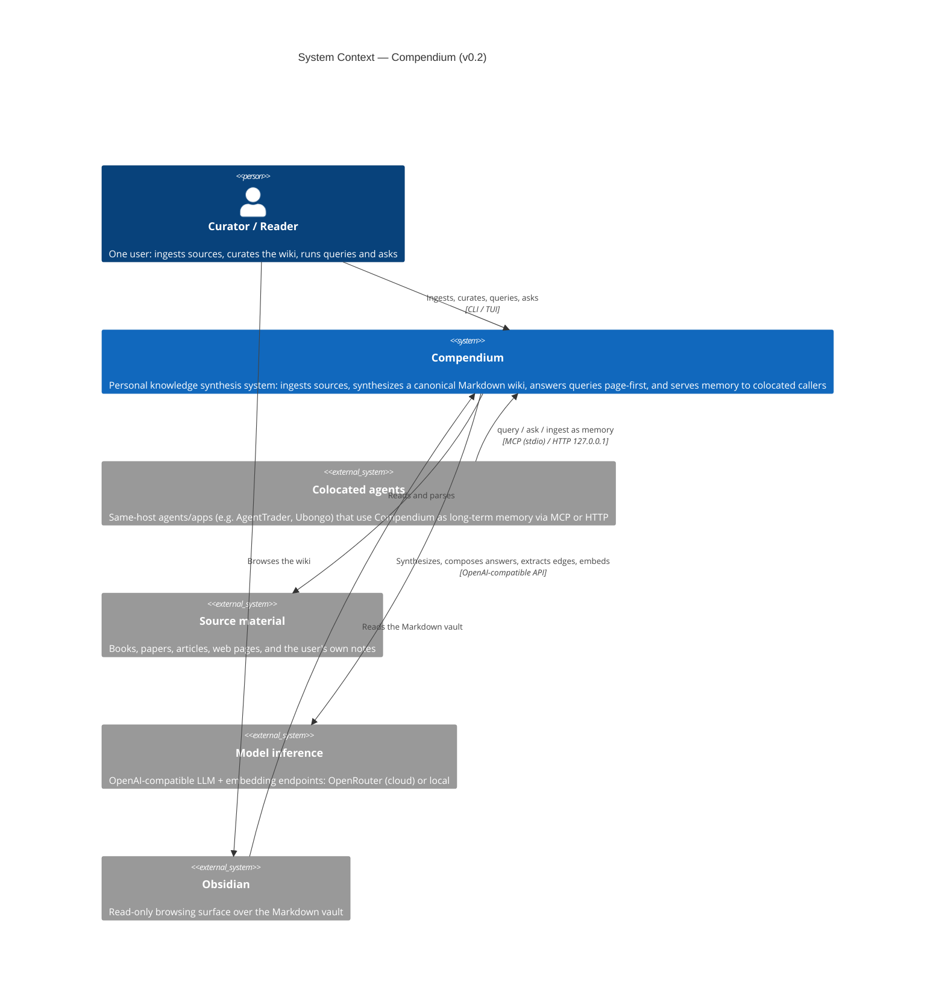

# C4 Level 1 — System Context

Compendium and the people and external systems it touches (v0.2).

## Notes

- **One user, one machine.** Compendium is not multi-user and not hosted. The
  curator and the reader are the same person.
- **Colocated agents (v0.2, ADR-011).** Other programs on the *same host* call
  Compendium as long-term memory through the access surface — MCP over stdio or
  HTTP on `127.0.0.1`, no auth. Network exposure and authentication are deferred
  to v0.3; today callers must be colocated.
- **Source material** is anything the user has read or written; their own notes
  and finished writing are ingested as first-class sources with provenance.
- **Model inference** is one external concern with interchangeable backends,
  selected by configuration. As of v0.2 the default for both synthesis and
  embeddings is OpenRouter (`anthropic/claude-sonnet-4.5`; `BAAI/bge-m3`), since
  BGE-M3 is not in the local Docker Model Runner catalogue.
- **Obsidian** is a read view only; the vault is plain Markdown. The Textual TUI,
  not Obsidian, is the operations console.
