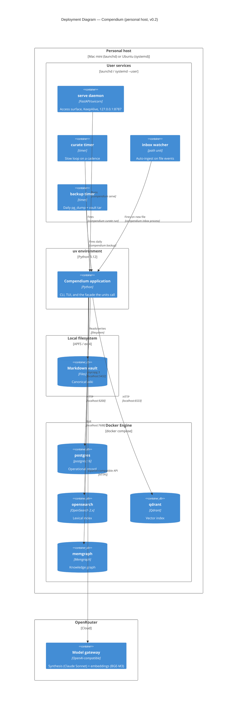

# C4 — Deployment

Compendium is local-first: it runs entirely on one machine (v0.2). `docker
compose` is the only orchestration the project uses, and that is the deliberate
ceiling — no Kubernetes, no managed services, no cloud. In v0.2 the application
also runs as always-on user-level services (ADR-012).

## Notes

- **One machine, two layers.** The four data stores run as Docker containers
  from a single dev `docker-compose.yml`; the application runs natively under
  `uv` (not containerized). The vault is a directory on the local filesystem.
- **Always-on user services (ADR-012).** `deploy/install.sh` installs four
  user-level units: `serve` (a KeepAlive daemon — the access surface), and three
  triggered units — `curate` (timer), `inbox` (path watcher), `backup` (timer).
  On macOS these are launchd LaunchAgents; on Linux, systemd `--user` units
  (enable **lingering** so they run without an active login). `deploy/compendiumctl`
  drives the running stack (`compendium start|stop|restart` are thin CLI adapters over
  it, PR #63); MCP is launched per-session by the client, not a unit. The serve daemon
  also answers SIGUSR1/SIGUSR2 with the opt-in tracemalloc memory profiler
  (artifacts in `~/.compendium/profiles`).
- **Model inference is OpenRouter** for both synthesis (`anthropic/claude-sonnet-4.5`)
  and embeddings (`BAAI/bge-m3`) as of v0.2 — BGE-M3 is not in the local Docker
  Model Runner catalogue, so the v0.1 "embeddings always local" note no longer
  holds. A local OpenAI-compatible endpoint remains config-selectable.
- **Host ports are remapped** so Compendium coexists with other local stacks:
  Qdrant `6533` (container `6333`), Memgraph `7688` (container `7687`);
  PostgreSQL `5432` and OpenSearch `9200` keep defaults. Full runbook:
  [`../operations/deployment.md`](../operations/deployment.md).
