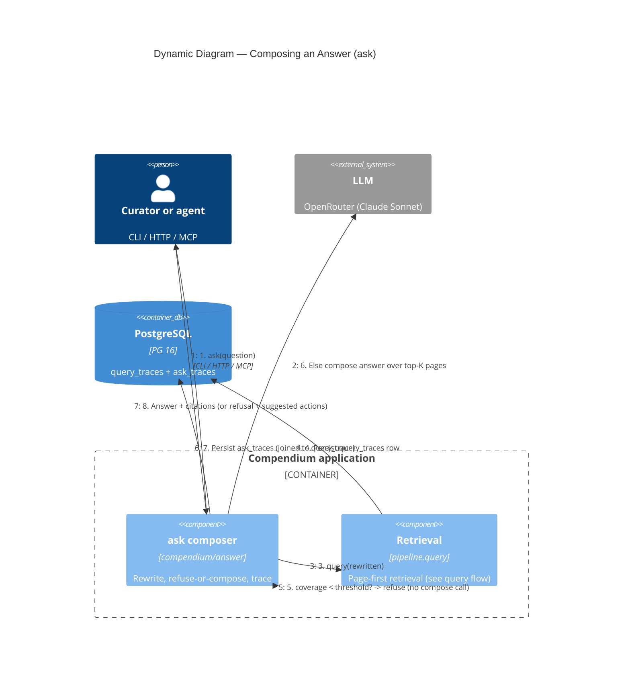

# C4 Dynamic — Ask Flow (composed answers)

What happens on `compendium ask` (or the `ask` verb over the access surface).
v0.2 Phase 6, ADR-011; code in [compendium/answer/](../../compendium/answer/).

## Notes

1. The caller asks a natural-language question (the same path for the CLI and the
   access surface — both reach `answer.ask` through the shared facade).
2. **Query rewrite (Shape D part 2).** One LLM call rewrites the question into a
   retrieval-friendly query. This is the *only* place an LLM touches retrieval;
   the cost-free `query` hot path is never rewritten.
3. The rewritten text drives the standard page-first pipeline
   ([query flow](c4-dynamic-query.md)).
4. That pipeline writes its own `query_traces` row; `ask` captures its id.
5. **Refusal gate.** If the retrieval `coverage_score` is below
   `ask.refuse_below_coverage` (default 0.3), `ask` does **not** call the LLM to
   compose — it returns `refused=true`, a populated `gap`, and `suggested_actions`
   naming the next step (ingest / synth). Refusal costs one LLM call (the
   rewrite), not two.
6. Otherwise the composer makes one LLM call over the top-K page excerpts and
   produces an answer with inline `[n]` citations mapped to those pages. In text
   mode the answer streams token-by-token via an `on_token` callback.
7. An `ask_traces` row records the prompt template id, model, endpoint, token
   counts, a best-effort cost estimate, and the answer text, joined to the
   `query_traces` row by `query_trace_id`.
8. The structured result (`{answer, refused, citations[], coverage_score,
   trace_id, ask_trace_id, gap, suggested_actions}`) is returned — identical over
   CLI `--format json`, HTTP, and MCP.
