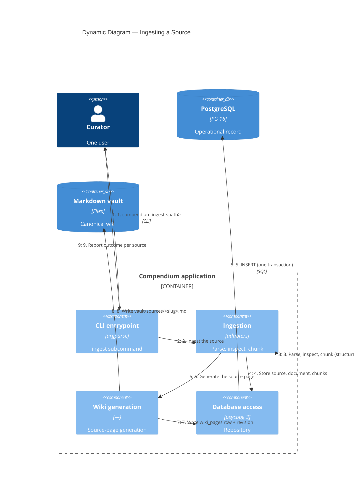

# C4 Dynamic — Ingestion Flow

What happens when the curator ingests a source. Synchronous and in-process;
no job queue.

## Notes

1. The curator points `ingest` at a file, a URL, or a directory (each file
   in a directory is its own source).
2–3. The matching adapter (PDF, EPUB, Markdown, HTML) parses the source into
   text and structural sections; inspection classifies it `passed`,
   `passed_with_warnings`, or `failed`; the chunker splits it structure-aware
   with a sliding-window fallback.
4–5. The source, its document record, and its chunks are written to
   PostgreSQL in a single transaction. Re-ingesting an unchanged source
   (same content hash) is a no-op.
6–8. For a source with chunks, a deterministic `source` page is generated and
   written to the vault, with a `wiki_pages` row and a `wiki_page_revisions`
   snapshot. A failed, chunkless source gets no page.
9. The CLI reports, per source, whether it was stored, unchanged, or failed.
