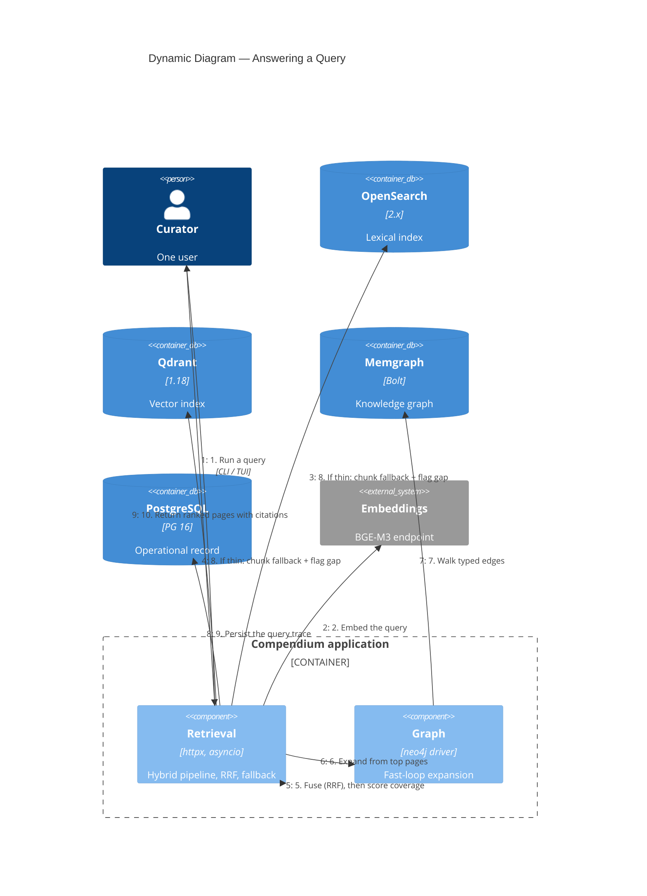

# C4 Dynamic — Query Flow

What happens when the curator runs `compendium query`. This is the page-first
retrieval pipeline (ADR-003), in [compendium/retrieve/pipeline.py](../../compendium/retrieve/pipeline.py).

## Notes

1–2. The query is parsed (no rewriting in v0.1) and embedded once, synchronously,
   via the BGE-M3 endpoint.
3–4. Lexical and dense searches run in parallel over the `pages` index and
   collection (`httpx` + `asyncio.gather`).
5. Reciprocal rank fusion (`rrf_k=60`) merges the two ranked lists, then a
   coverage score — the mean of the top-`k` min-max-normalized fused scores —
   is computed against `page_coverage_threshold` (0.5).
6–7. The fast loop walks the graph from the top candidates along typed edges
   (`RELATED_TO`, `PREREQUISITE_FOR`, `SYNTHESIZES`, …) to surface related
   pages a similarity search would miss; the expansion is logged into the trace.
8. If coverage is below threshold, the pipeline also fans out to the `chunks`
   index/collection, fuses, surfaces chunk citations, sets `fallback_to_chunks`,
   and writes a `low_coverage` gap.
9. The full pipeline state — candidates per stage, fusion, coverage, expansion,
   latencies, fallback flags, gaps, and the query embedding — is written to
   `query_traces`. Every query is replayable (`compendium trace replay`).
10. The result is a ranked list of wiki pages with supporting chunk citations.
   v0.1 returns pages, not an LLM-composed answer.

The slow curation loop (Phase 9) is the counterpart to this fast loop: it
aggregates trace gaps and graph signals into a curation queue that drives new
synthesis, which is what makes the wiki compound.
