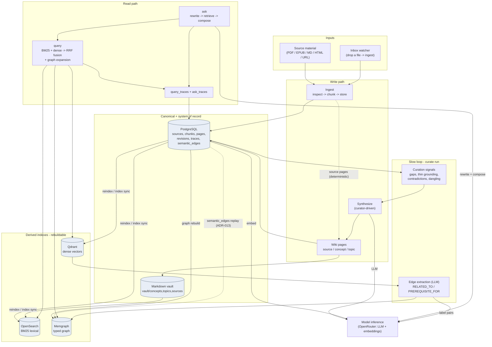

# Flow Diagram — End-to-End Data Flow

How knowledge moves through Compendium, from a raw source to a cited answer. This
is the whole system as one pipeline: the left half is **write-path** (ingest →
synthesize → index), the right half is **read-path** (retrieve → ask). It folds
in the v0.2 surfaces (`ask`, the access surface, the autonomous edge extractor)
and the post-v0.2 seams.

The Markdown vault is canonical (ADR-001); PostgreSQL is the system of record
(ADR-004); OpenSearch, Qdrant, and Memgraph are derived and rebuildable from the
first two (ADR-005). That is why every arrow into a derived store originates from
PostgreSQL or the vault, never from another derived store.

## How to read it

- **Write path (top-left).** A source enters by hand (`compendium ingest`) or via
  the inbox watcher (drop a file in `~/Compendium/inbox/<kind>/`). Ingestion
  inspects, chunks, and stores chunks with provenance in PostgreSQL, and emits a
  deterministic `source` page. `concept` and `topic` pages are synthesized
  **on demand** by the curator (one LLM call), never autonomously.
- **Canonical + system of record (center).** Every synthesized page is written to
  the **Markdown vault** (canonical) and recorded in **PostgreSQL** (system of
  record, with a revision per write).
- **Derived indexes (right-center).** `compendium reindex` / `index sync`
  projects PostgreSQL + the vault into OpenSearch (BM25), Qdrant (dense vectors,
  embedded via the model endpoint), and Memgraph (typed graph). These rebuild
  from the canonical stores; the dotted `semantic_edges replay` arrow is the
  ADR-013 fix that re-hydrates LLM/curator edges into Memgraph on
  `graph rebuild` so the graph is fully derived without data loss.
- **Read path (right).** `query` fans out to the three indexes, fuses with RRF,
  expands over the graph, and writes a `query_traces` row. `ask` wraps `query`:
  it rewrites the question (one LLM call), retrieves, and — above the coverage
  threshold — composes a cited answer (a second LLM call), recording an
  `ask_traces` row. Below threshold it refuses without composing.
- **Slow loop (bottom).** `compendium curate run` reads PostgreSQL to surface
  curation **signals** (which feed back into synthesis) and runs the autonomous
  **edge extractor** (ADR-010): for changed concept/source pages it pulls Qdrant
  neighbours, asks the LLM to label each pair, and writes high-confidence
  `RELATED_TO` / `PREREQUISITE_FOR` edges into Memgraph with provenance.

For step-by-step call sequences see the [UML sequence diagrams](uml-sequence.md);
for the C4-level dynamic views see the [query flow](c4-dynamic-query.md) and
[ask flow](c4-dynamic-ask.md).
