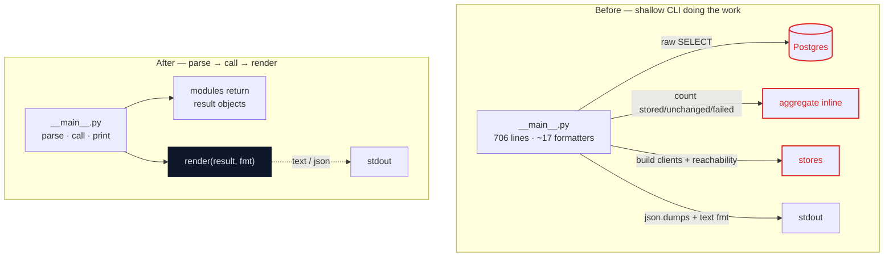
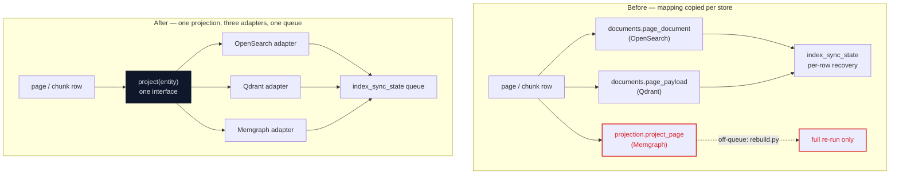

# Architecture Review — 2026-05-26

A deepening review of Compendium v0.1 (phases 0–10 merged), in the vocabulary of
**deep vs shallow modules**, **seams**, **adapters**, **leverage**, and **locality**. The
rich visual version is [architecture-review-2026-05-26.html](architecture-review-2026-05-26.html)
(open it in a browser); this Markdown is the reviewable source of truth.

The deep seams already in the codebase are exemplary and are **not** candidates: the
`Embedder` protocol with its stub/real adapters ([compendium/index/embedder.py](../../compendium/index/embedder.py)),
`pipeline.run()`'s injectable clients ([compendium/retrieve/pipeline.py](../../compendium/retrieve/pipeline.py)),
and the graph-expansion hook that never leaks Memgraph into retrieval
([compendium/retrieve/expansion.py](../../compendium/retrieve/expansion.py)). The friction
concentrates in four shallow spots below.

Legend: solid box = module · dashed = seam · red = leakage · dark = deep module.

---

## 1 · Pull presentation out of the CLI behind one seam

**Strength: Strong** · dependency: in-process

**Files:** [compendium/__main__.py](../../compendium/__main__.py) · [ingest/pipeline.py](../../compendium/ingest/pipeline.py) · [index/sync.py](../../compendium/index/sync.py) · [retrieve/pipeline.py](../../compendium/retrieve/pipeline.py) · [trace/](../../compendium/trace/) · [wiki/lint.py](../../compendium/wiki/lint.py)

**Problem.** Aggregation, a raw `SELECT id FROM sources`, client construction with reachability
checks, and ~17 one-off formatters leak into the CLI; the modules hand back bare lists and dicts.

**Solution.** Modules return rich result objects; one presentation module renders any of them as
text or JSON. Handlers shrink to parse → call → print.

**Wins**
- interface shrinks at every handler
- locality: formatting concentrates in one module
- leverage: formatters become pure and testable
- deletes the raw SQL from the CLI
- two adapters justify the seam: text, json
- deletion test: complexity reappears across 17 call sites

---

## 2 · One projection seam; put Memgraph on the sync queue

**Strength: Worth exploring** · dependency: ports & adapters

**Files:** [index/sync.py](../../compendium/index/sync.py) · [index/documents.py](../../compendium/index/documents.py) · [graph/projection.py](../../compendium/graph/projection.py) · [graph/rebuild.py](../../compendium/graph/rebuild.py) · [index/opensearch.py](../../compendium/index/opensearch.py) · [index/qdrant.py](../../compendium/index/qdrant.py)

**Problem.** The entity→store mapping is re-derived across `documents.py`, `projection.py`, a
three-branch `_write_one`, and a separate `rebuild.py`; Memgraph isn't on `index_sync_state`, so
it has no per-row failure recovery — a mid-rebuild failure means a full re-run.

**Solution.** One "project entity to derived stores" interface with one adapter per store
(OpenSearch, Qdrant, Memgraph); the graph joins the sync queue so all three drain and recover
through one path.

**Wins**
- locality: a schema change hits one module, not three mappers
- leverage: one drain path for all stores
- graph gains per-row failure recovery
- three adapters make the seam real
- "how a page reaches all indexes" reads in one place
- tests target the projection interface, not six files

> **ADR note.** Consistent with ADR-005 (the stores stay derived and distinct). It revisits only
> the *implicit* choice that graph rebuild is an off-queue command — worth reopening because that
> asymmetry is a real recovery gap, not a styling preference.

---

## 3 · One factory + lifecycle per store, mirroring `db.connection`

**Strength: Worth exploring** · dependency: local-substitutable

**Files:** [index/clients.py](../../compendium/index/clients.py) · [retrieve/clients.py](../../compendium/retrieve/clients.py) · [graph/client.py](../../compendium/graph/client.py) · [db/connection.py](../../compendium/db/connection.py)

**Problem.** OpenSearch/Qdrant URL-from-config and constructor args are copied across the sync
(`index/clients.py`) and async (`retrieve/clients.py`) factories; Memgraph drivers are built in
six modules and closed by hand, unlike the one enforced Postgres lifecycle (`connection()`).

**Solution.** A single config→URL resolution step plus a `graph_connection()` context manager
mirroring `db.connection`. The sync/async split stays — those are two genuine adapters (indexing
needs sync, the query fan-out needs async); they should share resolution, not return type.

| Store | Before | After |
|---|---|---|
| Postgres | one managed seam — `connection()` commits/rolls back/closes | unchanged (the model to imitate) |
| OpenSearch | URL+args copied across sync and async factories | shared resolution; two real adapters |
| Qdrant | URL+args copied across sync and async factories | shared resolution; two real adapters |
| Memgraph | driver built in 6 modules, `.close()` by hand | `graph_connection()` context manager |

**Wins**
- locality: URL/auth logic in one place
- leverage: enforced close, like Postgres
- two adapters (sync index, async query) are real, not hypothetical
- removes a class of leaked-driver bugs

---

## 4 · `repository.py` boilerplate (mostly leave it shallow)

**Strength: Speculative** · dependency: in-process

**Files:** [compendium/db/repository.py](../../compendium/db/repository.py) — 1035 lines, 53 functions

**Problem.** Three identical `all_*_ids` functions, duplicated dynamic `WHERE`-builders, and
inconsistent UUID coercion (str vs `UUID` at the seam). About 75% of functions are one-query
pass-throughs where the interface nearly matches the implementation.

**Solution.** Collapse only the trivial duplication and standardize UUID coercion. Do **not** add
a query-builder or ORM. The deep functions already earn their keep: `enqueue_index`,
`set_page_topics`, `ensure_corpus_revision`.

> **ADR note — don't deepen broadly.** The repository's shallowness is *mandated* by the
> "raw SQL, no ORM; thin `db/` repository" rule (CLAUDE.md / ADR-004). A deeper query abstraction
> would contradict it. Recorded here so future reviews stop re-suggesting it — the only real win
> is deleting copy-paste, not adding depth.

---

## Top recommendation

**Tackle candidate 1 first** — pull presentation out of the CLI. Highest leverage for the lowest
risk: it touches no ADR, concentrates the most scattered complexity (~17 formatters, an inline
query, client wiring), and turns presentation into pure, testable adapters behind one seam. Then
candidate 2 (the projection seam) for the deeper payoff of giving Memgraph the same per-row
recovery the other two stores already have.
