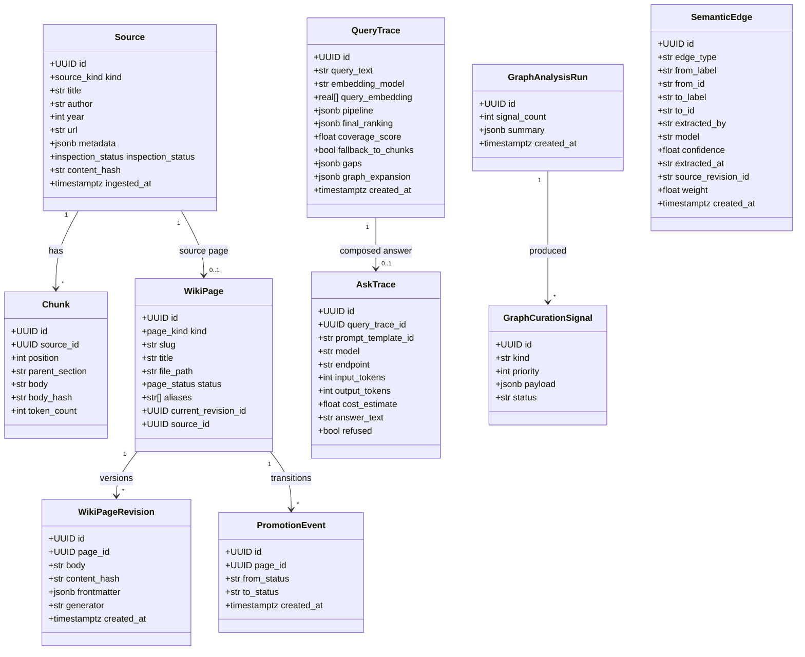
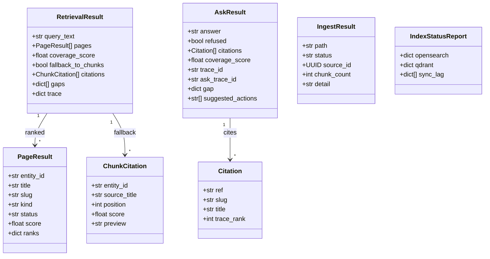

# UML — Data Model

Two UML class diagrams: the **persisted entities** (PostgreSQL, the system of
record) and the **result / contract types** (the dataclasses the verbs return,
which are also the access-surface JSON shapes). Persisted schema is the Alembic
migrations under [migrations/versions/](../../migrations/versions/); the
dataclasses live in `compendium/`.

## Persisted entities (PostgreSQL)

Notes: PostgreSQL is the only permanent schema (ADR-004). `WikiPage.file_path`
points at the canonical Markdown in the vault (ADR-001). `ask_traces` (v0.2
Phase 6, migration 0012) is a companion to `query_traces`, joined by
`query_trace_id`. `semantic_edges` (post-v0.2 fix, migration 0013, ADR-013) is
the system-of-record home for the graph's semantic edges (`RELATED_TO` /
`PREREQUISITE_FOR` / `SYNTHESIZES` / `CONTRADICTS`) with their provenance; one row
per directed edge, replayed into Memgraph on `graph rebuild`. The derived stores
(OpenSearch / Qdrant / Memgraph) are not shown — they are projections of these
rows + the vault (Memgraph's structural edges from the projection, its semantic
edges from `semantic_edges`).

## Result / contract types (the verb return shapes)

These dataclasses are what `query` / `ask` / `ingest` / `index_status` return,
and (serialized identically) the access-surface JSON.

Notes: `ask` composes **over** a `RetrievalResult` (it does not re-retrieve), so
`AskResult.citations[].trace_rank` indexes into the same ranking a plain `query`
would return. `IngestResult.status` is one of `ingested` / `updated` /
`unchanged` / `failed`.
