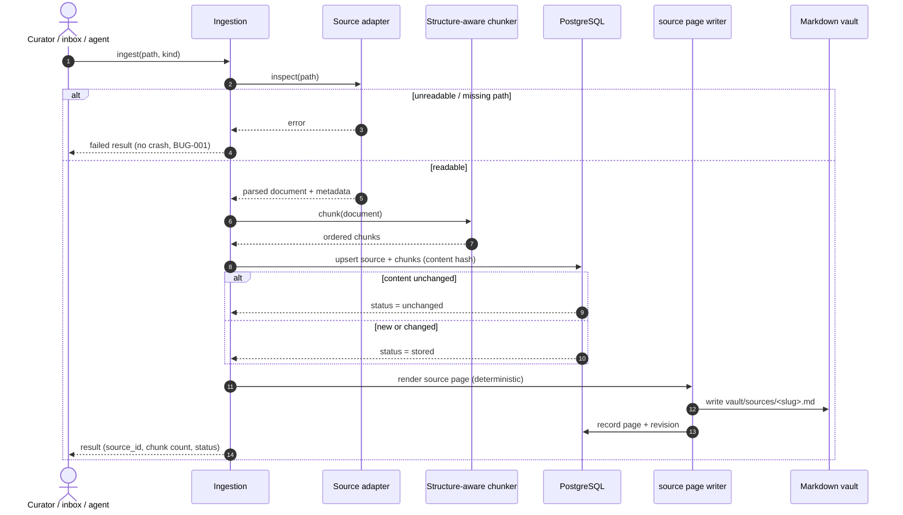
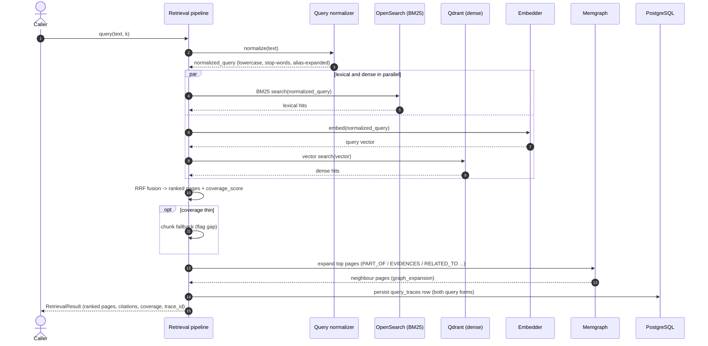
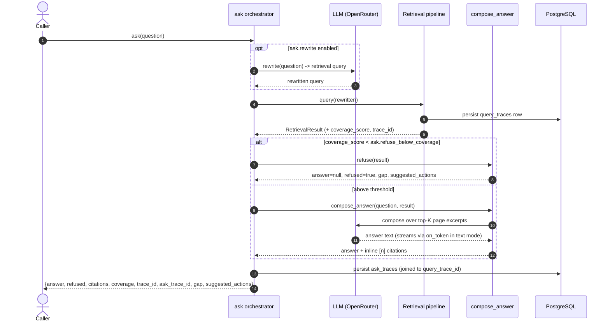

# UML Sequence Diagrams

Step-by-step call sequences for the three core flows, as UML sequence diagrams
(Mermaid `sequenceDiagram`). These complement the C4 dynamic views
([ingestion](c4-dynamic-ingestion.md), [query](c4-dynamic-query.md),
[ask](c4-dynamic-ask.md)): the C4 diagrams show *which components* talk; these
show *temporal ordering*, returns, alternative branches, and loops.

All three are derived from the code under [../../compendium/](../../compendium/).
Where the two differ, the code wins.

## 1. Ingestion

`compendium ingest <path> --kind <kind>` (or the inbox watcher / access-surface
`ingest` verb). Re-ingesting the same content is idempotent.

## 2. Page-first query

`compendium query "<text>"` (or the `query` verb). No LLM on this hot path; the
fan-out is async (`httpx` + `asyncio.gather`) over the three derived stores.

## 3. Composed answer (ask)

`compendium ask "<question>"` (or the `ask` verb). Wraps the query pipeline; the
only LLM touch points are the rewrite and the composition. Refusal below the
coverage threshold costs one LLM call (the rewrite), not two.

## Notes

- The query and ask result shapes are identical across CLI `--format json`, HTTP,
  and MCP — one shared serializer guarantees it (see [agents.md](agents.md)).
- `compose_answer` is the public, database-free seam (post-v0.2 fix, PR #55);
  `ask` is the single-path orchestrator that adds retrieval and trace
  persistence around it. There is no separate test-only retrieval fork.
- The autonomous edge-extraction loop (`curate run`, ADR-010) is not shown here
  because it runs on a schedule rather than per user call; see the
  [flow diagram](flow-diagram.md) bottom section and
  [../operations/edge-extraction.md](../operations/edge-extraction.md).
