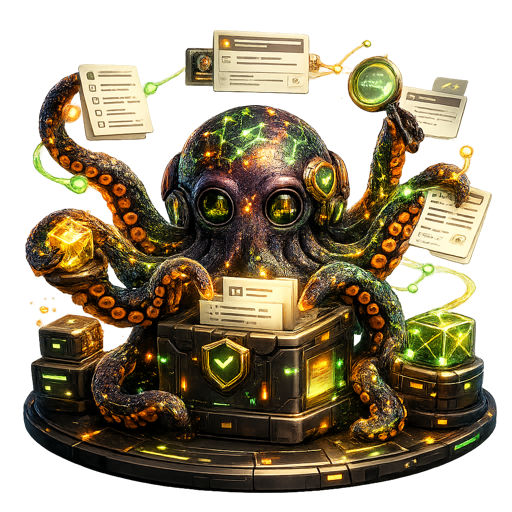

  

# Compendium v0.3 — Build Plan

The execution plan for v0.3. Mirrors the discipline of
[COMPENDIUM_BUILD.md](COMPENDIUM_BUILD.md) (v0.1) and
[COMPENDIUM_V0.2_BUILD.md](COMPENDIUM_V0.2_BUILD.md): each phase has a verbatim
**Goal**, verbatim **Acceptance**, a single branch, a small smoke test appended
to [tests/manual/smoke_test.md](../tests/manual/smoke_test.md), and a clear exit
gate. The new architectural decisions land as **ADR-014** (autonomous
`CONTRADICTS` as curator-approved suggestions) and **ADR-015** (the Streamlit
web UI / stack-discipline exception), inline in [Compendium.md](Compendium.md);
the glossary lives in [../CONTEXT.md](../CONTEXT.md).

## Status

v0.1 and v0.2 are both feature-complete and merged to `main` (v0.1 phases 0–10;
v0.2 phases 1–8; plus the post-v0.2 deepening seams, PRs #48–#55 incl. ADR-013).

v0.3 is **two phases**, both pulled forward from the v0.2 "Deferred to v0.3"
list by an explicit curator decision (2026-06-10):

| # | Phase | Branch | Ships ADR | Version on completion |
| --- | --- | --- | --- | --- |
| 1 | Autonomous `CONTRADICTS` (curator-approved suggestions) | `v0.3-phase-1-contradicts` | **ADR-014** | `0.2.4` |
| 2 | Web UI (Streamlit, loopback) | `v0.3-phase-2-web-ui` | **ADR-015** | `0.2.5` |

Status: **complete — both phases merged 2026-06-12** (Phase 1 PR #74, ADR-014,
0.2.4; Phase 2 PR #75, ADR-015, 0.2.5). The 0.3.0 consolidation cut + the C4
refresh close the plan out on `main`.

### Versioning during the v0.3 build

The package stays on the **`0.2.x` line for the duration of the v0.3 build**, and
bumps the **patch by one on each completed phase** (current: `0.2.3`; Phase 1
done → `0.2.4`; Phase 2 done → `0.2.5`). The minor bump to **`0.3.0` happens only
when the entire v0.3 build plan is complete** — both phases merged.

The canonical version is the root [`VERSION`](../VERSION) file;
`compendium.__version__` reads it at import and the FastAPI access-surface
`version` derives from `__version__`. Cut a version with the root release script
— [`./release.sh <version>`](../release.sh) — which updates `VERSION` + the
`pyproject.toml` mirror, refreshes `uv.lock`, inserts a dated `CHANGELOG.md`
section stub, and rebuilds the `2Deploy/` distribution (`./deploy/make-bundle.sh`)
in one command. For example, the phase's final commit runs
`./release.sh 0.2.4 --commit` (Phase 1).

## v0.3 thesis

> v0.3 closes the last two curator-facing gaps in the synthesis loop without
> changing Compendium's posture. The graph learns to *propose* the one semantic
> claim it was not allowed to make — `CONTRADICTS` — but only as a suggestion the
> curator approves, never an autonomous write. And the wiki gets a browser-native
> surface for the read / ask / curate work that today only the terminal can do.
> Still single-user, still single-host, still loopback-only: **multi-tenancy and
> network exposure stay deferred.**

Every phase below serves that thesis; every exclusion exists to protect it.

## Why these two, in this order

Phase 1 (`CONTRADICTS`) lands first because it reuses the v0.2 Phase 8 extractor
plumbing (`compendium/curate/extract.py`, the Qdrant-neighbour pull, the
`Extractor` seam) and produces a new curation signal. Phase 2 (the web UI) can
then surface those contradiction candidates in its curation view, so building the
signal first means the UI has something real to render. The order is a
recommendation; the curator may swap it. The two phases are otherwise
independent.

## Scope

### In scope (two phases)

1. **Autonomous `CONTRADICTS` as curator-approved suggestions.** A new slow-loop
   generator proposes `CONTRADICTS` candidates into the curation queue; the
   curator approves or drops each; approval writes a curator-owned `CONTRADICTS`
   edge. The LLM never writes a `CONTRADICTS` edge directly.
2. **Streamlit web UI (loopback).** A browser surface — ask, search, browse
   pages, drain the curation queue (including the new contradiction candidates) —
   running on `127.0.0.1`, reusing the existing access-surface facade and the
   TUI's in-process data/curation paths. No new answer or retrieval logic.

### Deferred to v0.4 or beyond (unchanged from v0.2's list, minus the two pulled forward)

- **Multi-project namespacing** — single shared namespace stays.
- **Network exposure + auth** — MCP-SSE / HTTP over LAN with token / Tailscale /
  TLS. The web UI is **loopback-only** in v0.3; exposing it to the LAN is the
  same deferred decision as exposing the HTTP/MCP surface, and earns its place
  together with them.
- **gRPC** — no cross-machine / typed-polyglot earning case yet.
- **Autonomous extraction of `SYNTHESIZES`** — stays owned by
  `curate/lifecycle.address_on_promote`. Forever.
- **pgvector** — only when trace-similarity analysis earns it.

### Out of scope (stack-discipline lines that **stay** intact)

- No cloud deployment, no SaaS, no hosted service.
- No multi-user, no auth — the web UI is colocated/loopback only, exactly like
  the v0.2 access surface (ADR-011).
- No Kafka, no Airflow, no Redis, no separate object store, no JS/Node build
  toolchain.
- No real-time / streaming ingestion (batch only, automated via the inbox).
- `CONTRADICTS` is **never** written autonomously — only proposed. `SYNTHESIZES`
  is never extracted at all.

## Resolved decisions

- **`CONTRADICTS` shape (ADR-014, reverses the v0.2 "curator-only / deferred"
  line for the *suggestion* half only).** Shape C from ADR-010's taxonomy:
  *LLM-proposed, curator-approved*. The generator writes a **curation signal**,
  not a graph edge. Approval is a curator action that writes the edge with
  `extracted_by="curator"` provenance — so the existing curator-protection
  invariant (`schema.upsert_semantic_edge` never lets an `extracted_by="llm"`
  write touch a curator edge) holds unchanged. The LLM half is bounded exactly
  like Phase 8: top-K=10 Qdrant neighbours per changed concept page, one LLM call
  per page, confidence threshold (default `0.7`, configurable), pairs already
  linked by any edge pre-filtered.
- **Signal kind.** Reuse-or-extend the existing `curation_signal_kind` enum. The
  enum already has `unresolved_contradiction`; v0.3 adds a distinct
  `contradiction_candidate` value (migration `0014`) so a *proposed* contradiction
  is not confused with a curator-noticed one. (Open question Q1 below: reuse vs.
  add — leaning add, for provenance clarity.)
- **Approval action.** A new CLI verb `compendium curate resolve <signal_id>
  --approve | --drop` (and the equivalent TUI / web-UI action). `--approve` on a
  `contradiction_candidate` writes the `CONTRADICTS` edge via the curator path and
  transitions the signal to `addressed`; `--drop` transitions it to `dropped`.
  The signal payload carries the two page slugs and the LLM's rationale.
- **Web UI stack (ADR-015).** **Streamlit**, added to the tech stack as a
  deliberate, documented exception (the way ADR-012 reversed "no daemon"). It runs
  as a separate colocated process (`compendium web` / `streamlit run`), binds
  `127.0.0.1` only, and is **read/ask/curate**, not a second brain. It calls the
  existing `compendium/api/facade.py` for the six verbs and the existing
  `compendium/tui/data.py` provider (and `curate/` functions) for curation
  actions — **no third data layer, no new retrieval/answer logic.**
- **No network exposure.** Both phases stay loopback. The moment either leaves
  `127.0.0.1` is a separate v0.4 decision (auth + TLS), not a flag to flip.

## Phased build plan

Each phase is sized to ~one focused weekend; if a phase takes more than two, its
scope is wrong.

### Phase 1 — Autonomous `CONTRADICTS` (curator-approved suggestions)

**Branch:** `v0.3-phase-1-contradicts`. **Ships ADR-014.**

**Goal:** the slow loop autonomously *proposes* `CONTRADICTS` edges as curation
signals; the curator approves or drops each; an approved candidate becomes a
curator-owned `CONTRADICTS` edge in Memgraph. The LLM never writes a `CONTRADICTS`
edge directly.

**Acceptance:** a new generator (e.g. `from_contradiction_candidates` in
`compendium/curate/`, registered like the Phase 8 `from_extracted_edges`
generator) runs inside `compendium curate run`. For each concept page changed
since the last run (with the same periodic full-sweep cadence as Phase 8), it
pulls the top K=10 Qdrant neighbours, pre-filters pairs already linked by any
edge, and asks the LLM (one call per page, a new prompt id `contradict-v1` over
the `Extractor`/`SYNTHESIS_*` seam) to label each pair `CONTRADICTS` or `NONE`
with a confidence and a short rationale. Candidates `>= curation.contradict.
min_confidence` (default `0.7`) are written as `contradiction_candidate` curation
signals (migration `0014` adds the enum value), carrying the two page slugs, the
confidence, and the rationale in the payload — **no graph edge is written by the
generator.** `compendium curate resolve <signal_id> --approve` writes a
`CONTRADICTS` edge with `extracted_by="curator"` provenance and marks the signal
`addressed`; `--drop` marks it `dropped`. Curator-protection is unchanged. Every
proposal (written-as-signal / dropped-by-confidence / dropped-by-collision) is
logged via structlog and counted in the `graph_analysis_runs` summary. The
CLAUDE.md / ADR exclusion line "Autonomous extraction of `CONTRADICTS` deferred"
is updated to point at ADR-014.

**Smoke section:** seed a corpus with a known contradicting pair; run
`compendium curate run`; observe a `contradiction_candidate` signal (no edge yet);
`compendium curate resolve <id> --approve`; observe a `CONTRADICTS` edge with
`extracted_by="curator"` in `compendium graph status`; run `compendium curate run`
again and observe the candidate is not re-proposed (pre-filtered as already
linked).

### Phase 2 — Web UI (Streamlit, loopback)

**Branch:** `v0.3-phase-2-web-ui`. **Ships ADR-015.**

**Goal:** a browser surface for the daily read / ask / curate loop, on
`127.0.0.1`, reusing the existing facade and TUI data paths — no new retrieval or
answer logic, no network exposure.

**Acceptance:** `compendium web [--host 127.0.0.1] [--port 8501]` launches a
Streamlit app bound to loopback. It provides at least four views: **Ask** (a
question box that calls `facade.ask`, renders the composed answer with its
`[n]` citations linked to pages, and shows the refusal + suggested actions when
coverage is below threshold), **Search** (calls `facade.query`, renders the
ranked pages with coverage and citations), **Pages** (browse via
`facade.page_list` / `facade.page_get`, rendering frontmatter + Markdown body),
and **Curation** (drains the queue via the existing `curate/` provider, including
the Phase 1 `contradiction_candidate` signals, with **Approve / Drop** buttons
wired to the Phase 1 resolve action). The app imports `compendium/api/facade.py`
and the existing `compendium/tui/data.py` provider — it adds **no** third data
layer and **no** new retrieval/answer/compose code. Streamlit is added to the
stack via ADR-015 with the stack-discipline rationale; the new dependency is
declared in `pyproject.toml`. The loopback-only / no-auth posture is documented
as a deliberate v0.3 restraint, with the v0.4 network-exposure path noted in
ADR-015 (shared with ADR-011's deferral). A new operational doc
`docs/operations/web-ui.md` covers launch, the four views, and the posture.

**Smoke section:** `compendium web`; in the browser, ask a covered question (get
an answer + citations) and an uncovered one (get a refusal + suggested actions);
search and open a page; open the Curation view, see a `contradiction_candidate`
from Phase 1, click **Approve**, and confirm the `CONTRADICTS` edge appears in
`compendium graph status`.

## Per-phase workflow

Identical to v0.1 / v0.2:

1. **Branch** — `git checkout -b v0.3-phase-N-<name>` off the latest `main`.
2. **OpenSpec change** — create `openspec/changes/v0.3-phase-N-<name>/` with
   proposal, design, spec deltas, tasks (`/opsx:propose`).
3. **Phase Plan** — author `Plans/v0.3-phase-N-<name>.md` from
   [Plans/_TEMPLATE-phase-plan.md](../Plans/_TEMPLATE-phase-plan.md): sub-phases,
   tasks, the per-phase smoke test, open questions.
4. **Review gate** — the curator revises and approves the Phase Plan. No
   implementation code is written until it is approved.
5. **Draft PR** — after the first commit, open a draft PR against `main`, titled
   `v0.3 phase N — <Title>`, body linking the Phase Plan.
6. **Implement** — one commit per sub-phase (`v0.3 phase Na — <sub-phase>`), green
   at HEAD; final commit `v0.3 phase N complete — <short title>`, which also
   **bumps the patch version** (`0.2.3` → `0.2.4` for Phase 1, etc.): edit the
   `VERSION` file + the `pyproject.toml` mirror, add a `CHANGELOG.md` entry, and
   rebuild the `2Deploy/` bundle. Append the phase's smoke test to
   [tests/manual/smoke_test.md](../tests/manual/smoke_test.md).
7. **Verify** — run the phase's testing plan and smoke test; mark the PR ready.
8. **Merge** — the curator reviews and merges.

Every commit ends with the trailer
`Co-Authored-By: Claude Opus 4.8 (1M context) <noreply@anthropic.com>`.

## Open questions (resolve in the Phase Plans)

- **Q1 — signal kind for contradictions.** Add a distinct
  `contradiction_candidate` enum value (migration `0014`, leaning this way for
  provenance clarity), or reuse the existing `unresolved_contradiction`? Decide in
  the Phase 1 Plan.
- **Q2 — `curate resolve` generality.** Should `--approve`/`--drop` be generic
  over all signal kinds, or contradiction-specific in v0.3? Leaning generic
  (it is the missing inverse of `curate run`), contradiction-approval being its
  first concrete use.
- **Q3 — web-UI curation seam.** Does the Streamlit Curation view call
  `curate/` functions directly, or do we first extract a thin curation-actions
  provider that both the TUI and the web UI share (the same way `tui/data.py` is
  shared)? Leaning toward a small shared provider to avoid duplicating the
  approve/drop logic across two front-ends.
- **Q4 — `compendium web` vs `streamlit run`.** Wrap the launch in a `compendium
  web` subcommand (consistent with `serve` / `mcp` / `tui`) that shells/execs
  Streamlit, vs. documenting a raw `streamlit run` invocation. Leaning toward the
  subcommand for consistency and to centralize the loopback bind default.
- **Q5 — web UI as a service unit?** Should `compendium web` get an always-on
  launchd/systemd unit via the `service_unit/` seam (like `serve`), or stay
  manual-launch in v0.3? Leaning manual for v0.3 (it is interactive, not a
  background daemon).

## Documentation

- ADRs continue inline in [Compendium.md](Compendium.md): **ADR-014**
  (`CONTRADICTS` curator-approved suggestions) and **ADR-015** (Streamlit web UI /
  stack exception).
- Operational docs land in `docs/operations/`: `web-ui.md` (Phase 2); the
  `edge-extraction.md` doc is extended for the contradiction-candidate generator
  (Phase 1).
- The C4 docs in [architecture/](architecture/) are refreshed at the end of v0.3
  to fold in the web UI container and the contradiction-suggestion flow — same
  discipline as the v0.2 C4 refresh.
- The `CLAUDE.md` exclusion lines that v0.3 reverses ("Autonomous extraction of
  `CONTRADICTS` deferred"; "CLI + TUI only") get a one-line pointer to the ADR
  that supersedes them, in the relevant ADR-ships phase.
