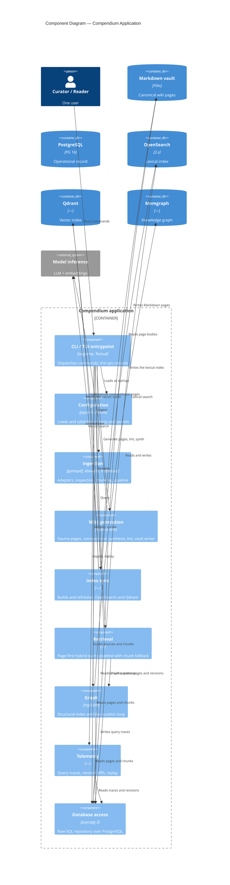

# C4 Level 3 — Components of the Compendium Application

The internal modules of the Compendium Python application. Each maps to a
sub-package under `compendium/`.

## Notes

- Every component reaches PostgreSQL through **`db`**, the raw-SQL repository
  — no ORM. PostgreSQL is the system of record; the other stores are written
  by `index` and `graph` and read by `retrieve`.
- **`wiki`** owns the canonical artifact: it generates deterministic `source`
  pages, synthesizes `concept`/`topic` pages via the LLM, lints frontmatter,
  and writes pages into the vault with a revision per write.
- **Build status:** `config`, `cli`, `ingest`, `wiki`, and `db` are built
  (Phases 0–3). `index` (Phase 4), `retrieve` (Phase 5), `graph` (Phases 6
  and 9), `trace` (Phase 7), and the Textual TUI (Phase 8) are designed but
  not yet implemented; their package directories exist as placeholders.
- The two loops that make the system compound — the fast per-query graph
  walk and the slow curation loop — live in `graph` and `retrieve`; see
  [c4-dynamic-query.md](c4-dynamic-query.md).
