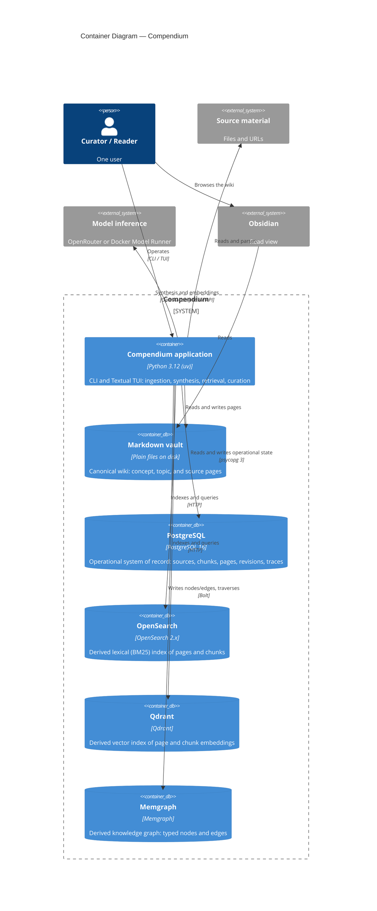

# C4 Level 2 — Containers

The runnable and storage units that make up Compendium.

## Notes

- **The Compendium application** is one Python process. The CLI
  (`python -m compendium`) and the Textual TUI are two entrypoints into the
  same package; ingestion runs synchronously in-process, with no job queue.
- **The Markdown vault is canonical** (ADR-001). Everything else inside the
  boundary is derived: PostgreSQL holds the operational record, and
  OpenSearch, Qdrant, and Memgraph are caches rebuildable from PostgreSQL plus
  the vault (ADR-005).
- **PostgreSQL is the system of record** (ADR-004). The application writes
  there first; the derived indexes follow via tracked sync state.
- **Build status:** the application, the vault, and PostgreSQL are built
  (Phases 0–3). OpenSearch and Qdrant arrive in Phase 4, Memgraph in Phase 6.
- The four data stores run as local Docker containers; see
  [c4-deployment.md](c4-deployment.md).
