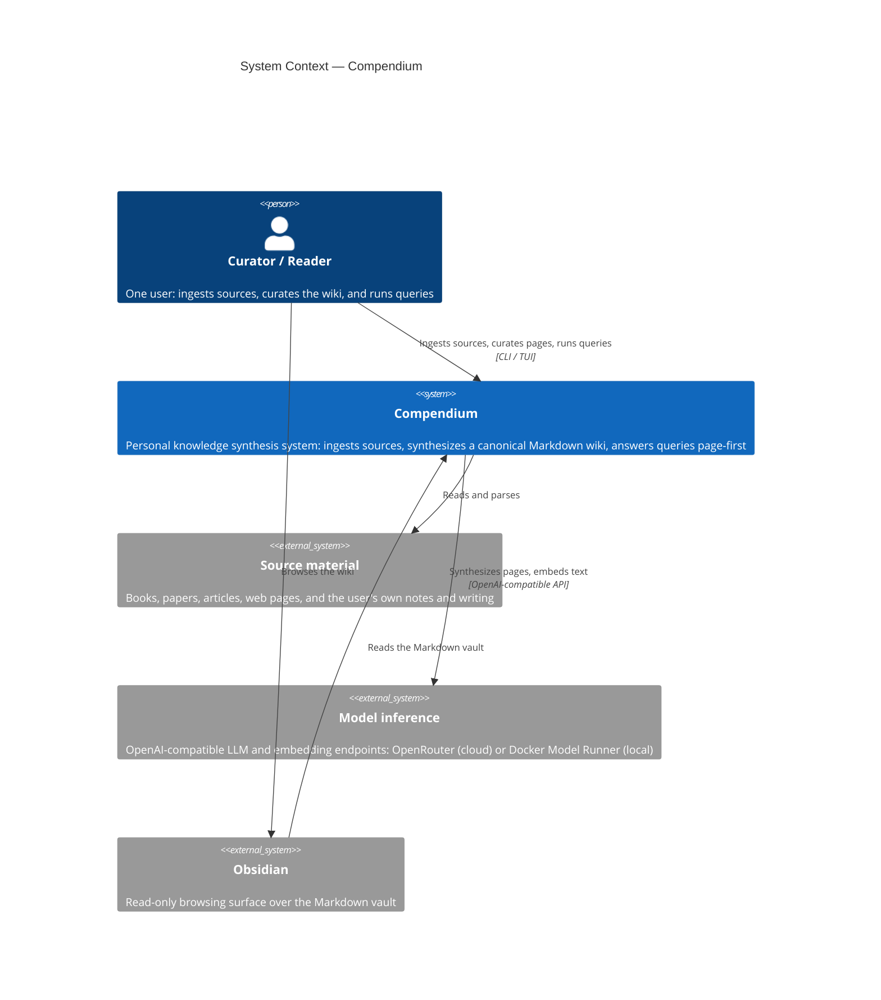

# C4 Level 1 — System Context

Compendium and the people and external systems it touches.

## Notes

- **One user, one machine.** Compendium is not multi-user and not hosted. The
  curator and the reader are the same person.
- **Source material** is anything the user has read or written. The user's own
  notes and finished writing are ingested as first-class sources, with
  provenance recorded.
- **Model inference** is a single external concern with two interchangeable
  backends, selected by configuration: OpenRouter (cloud) for synthesis
  quality, or Docker Model Runner (local) to keep ingested notes on-device.
  Embeddings are always served locally.
- **Obsidian** is a read view only. Compendium does not depend on Obsidian;
  the vault is plain Markdown that any editor can open. The Textual TUI, not
  Obsidian, is the operations console.
