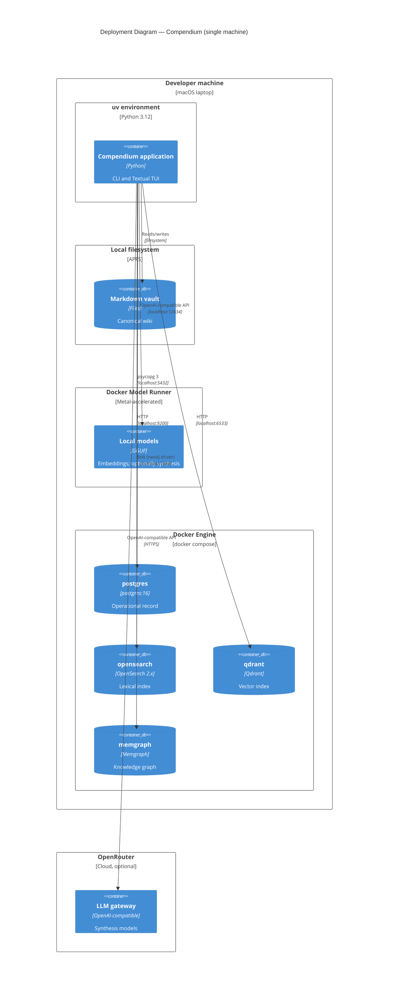

# C4 — Deployment

Compendium is local-first: it runs entirely on one machine. `docker compose`
is the only orchestration the project uses, and that is the deliberate
ceiling — no Kubernetes, no managed services, no cloud deployment.

## Notes

- **One machine.** The application runs natively under `uv`; the four data
  stores run as Docker containers from a single dev `docker-compose.yml`;
  Docker Model Runner runs models on the host with Metal acceleration; the
  vault is a directory on the local filesystem.
- **The application is not containerized.** Only the backing stores are.
  `docker compose up -d` starts them; the app runs outside Docker.
- **OpenRouter is the synthesis default** (`anthropic/claude-sonnet-4.5`),
  config-selectable against a local Docker Model Runner to keep ingested notes
  on-device. Embeddings always run locally on Docker Model Runner
  (`BAAI/bge-m3`, `localhost:12434`).
- **Host ports are remapped** so Compendium coexists with other local stacks:
  Qdrant is published on `6533` (container `6333`) and Memgraph on `7688`
  (container `7687`). PostgreSQL `5432` and OpenSearch `9200` keep their
  defaults. All four services live in one dev `docker-compose.yml`.
