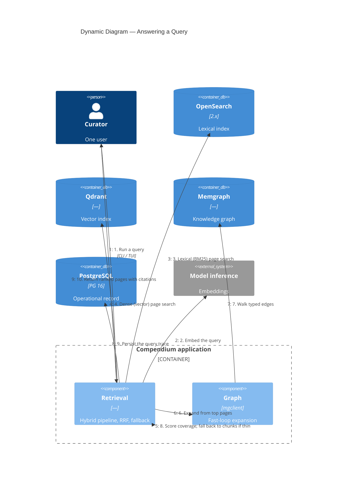

# C4 Dynamic — Query Flow

What happens when the curator runs a query. This is the page-first retrieval
pipeline (ADR-003). Designed for Phase 5; not yet built.

## Notes

1–2. The query is parsed (no rewriting in v0.1) and embedded.
3–5. Lexical and dense searches run in parallel over the `pages` indexes;
   reciprocal rank fusion merges the two ranked lists.
6–7. When page coverage is strong, the fast loop walks the graph from the top
   candidates along typed edges (`RELATED_TO`, `PREREQUISITE_FOR`,
   `SYNTHESIZES`) to surface related pages a similarity search would miss.
8. A coverage score decides the outcome: strong coverage returns pages;
   thin coverage falls back to chunk retrieval and flags the gap.
9. The full pipeline state — candidates per stage, fusion, expansion,
   latencies, fallback flags, gaps — is written to `query_traces`. Every
   query is replayable.
10. The result is a ranked list of wiki pages with supporting chunk
   citations. v0.1 returns pages, not an LLM-composed answer.

The slow curation loop (Phase 9) is the counterpart to this fast loop: it
aggregates trace gaps and graph signals into a curation queue that drives new
synthesis, which is what makes the wiki compound.
