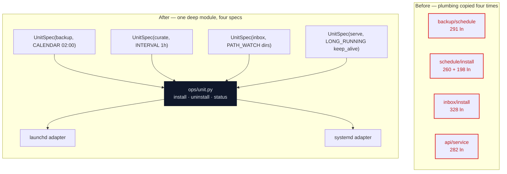
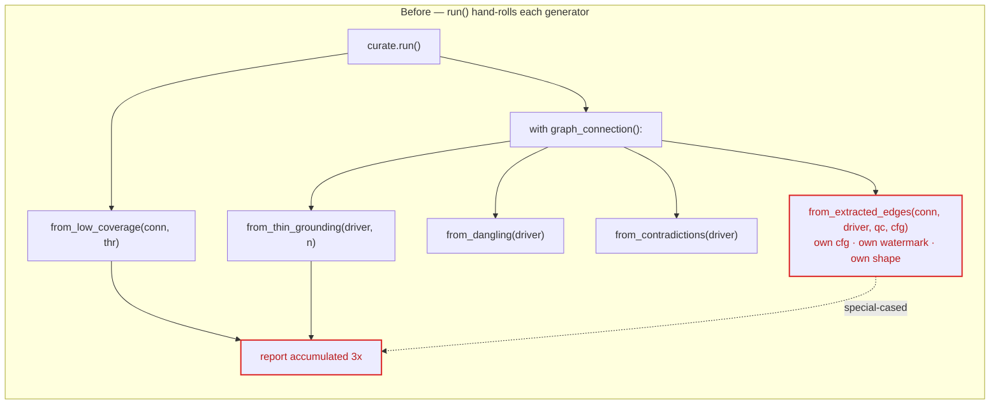
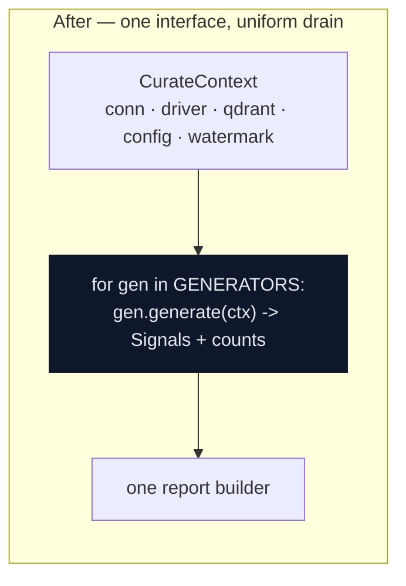

# Architecture Review — 2026-06-05

A third deepening pass, in the same vocabulary as [review #1](review-2026-05-26.md)
and [review #2](review-2026-05-26-2.md): **deep vs shallow modules**, **seams**,
**adapters**, **leverage**, **locality**, the **deletion test**. The rich visual
version was written to the OS temp dir (not committed); this Markdown is the
reviewable source of truth.

The two prior reviews deepened the **v0.1** surface (the CLI render seam, the
`StoreProjector`, the curation lifecycle, the TUI `DataScreen`, the graph
lifecycle — all merged). This pass covers what those reviews never saw: the
**eight v0.2 phases**. The access surface (`compendium/api/`) and answer
composition (`compendium/answer/`) came back clean and are **not** candidates —
they are noted at the end as already-deep. The friction concentrates in the four
always-on service installers and the curation slow loop.

Legend: solid box = module · dashed = seam · red = duplication / leak · dark = deep module.

| # | Candidate | Strength | Dependency |
|---|---|---|---|
| 1 | One service-unit seam for the four installers | **Strong** | ports & adapters |
| 2 | A `SignalGenerator` seam for the slow loop | Worth exploring | in-process |
| 3 | A store-context that owns config + client lifecycle | Speculative | local-substitutable |

---

## 1 · One service-unit seam for the four installers

**Strength: Strong** · dependency: ports & adapters

**Files:** [backup/schedule.py](../../compendium/backup/schedule.py) ·
[schedule/install.py](../../compendium/schedule/install.py) ·
[schedule/status.py](../../compendium/schedule/status.py) ·
[schedule/cadence.py](../../compendium/schedule/cadence.py) ·
[inbox/install.py](../../compendium/inbox/install.py) ·
[inbox/status.py](../../compendium/inbox/status.py) ·
[api/service.py](../../compendium/api/service.py)

**Problem.** Four modules — backup, curate schedule, inbox watcher, and the
access-surface daemon — each reimplement launchd + systemd from scratch:
platform detection, repo-root and plist paths, the plist XML skeleton, the
`launchctl bootout/bootstrap` dance, `systemctl daemon-reload/enable/disable`,
and the status parse. About 70% of ~1,160 lines is byte-for-byte duplication. A
fifth service means a fifth copy; a `launchctl` flag change means four edits.

The duplication is concrete and verbatim:

| Repeated unit | Locations (identical or near-identical) |
|---|---|
| `_platform()` | backup/schedule.py:55 · schedule/install.py:39 · inbox/install.py:51 · api/service.py:63 |
| `_repo_root()` · `_macos_plist_path()` · `_macos_log_dir()` | all four, same body |
| `_macos_plist_xml()` skeleton (`<?xml … plist>` + ProgramArguments loop + WorkingDirectory + StandardOut/ErrPath) | all four; only the trigger keys differ |
| `_linux_unit_dir()` + `[Unit]/[Service]` unit string | all four |
| `launchctl bootout → bootstrap` (+ returncode check) | backup:130 · schedule:109 · inbox:138 · api/service:131 |
| `systemctl daemon-reload` + `enable --now` / `disable --now` | all four |
| `class *Error(step, detail)` + `@dataclass *Result(action, path, detail)` | `ScheduleError`/`InboxError`/`ServiceError` identical shapes; only `cadence.ScheduleError` is shared |
| status parsing of `launchctl`/`systemctl` output | schedule/status.py (198 lines) and api/service.py (~30 lines) share zero code |

Only one thing is actually shared today: `ScheduleError` is exported from
`schedule/cadence.py` and imported by `schedule/install.py`. `backup/schedule.py`
defines its own copy anyway.

**Solution.** One `compendium/ops/unit.py` module owns everything a unit needs —
XML/INI generation, the `launchctl`/`systemctl` subprocess wrapping, paths, the
error and result types, and status parsing. Each trigger flavour (calendar,
interval, path-watch, long-running) is a field on a `UnitSpec`, not a forked
copy. Two adapters sit behind the interface: launchd and systemd. Every caller
drops to a spec plus one call.

**Wins**
- locality: a `launchctl`/`systemd` change hits one module
- leverage: one interface, four (soon N) callers
- interface shrinks to a `UnitSpec` per service
- two adapters make the seam real: launchd, systemd
- the test surface becomes one module, not four
- deletion test: complexity reappears across all four installers

> **ADR note.** Consistent with ADR-012 (always-on personal service). It touches
> no decision — only the *implicit* choice to copy the unit plumbing per phase.
> The four phases (2, 3, 4, 7) shipped independently, so the duplication is
> historical, not designed.

---

## 2 · A `SignalGenerator` seam for the slow loop

**Strength: Worth exploring** · dependency: in-process

**Files:** [curate/run.py](../../compendium/curate/run.py) ·
[curate/signals.py](../../compendium/curate/signals.py) ·
[curate/extract.py](../../compendium/curate/extract.py)

**Problem.** `curate run` drives five generators with no shared interface. Four
return `Signal` tuples with bespoke signatures (`from_low_coverage(conn, thr)`
vs `from_thin_grounding(driver, n)`); the fifth — the LLM extractor
`from_extracted_edges(conn, driver, qc, cfg)` — is special-cased: its own config
load, its own reachability guard, its own exception strategy, a different return
shape (`ExtractReport`, not `Signal`), and watermark / changed-page logic that
exists nowhere else. The report is then accumulated post-hoc in three places
(the `CurateReport` dataclass, the by-kind loop, and the `summary` dict).

**Solution.** One `SignalGenerator` interface every generator satisfies, fed a
single `CurateContext` that owns the connection, driver, Qdrant client, config,
and the change-detection watermark. The extractor stops being a special case —
it becomes one more adapter behind the same seam. `run()` collapses to a loop;
the report is built once.

**Wins**
- locality: adding a generator is one adapter
- leverage: one loop drains all five
- watermark / changed-page logic lives in one place
- config + clients built once, not per generator
- report assembly stops being three-way
- the test surface is the generator interface

> **ADR note.** Consistent with ADR-009 / ADR-010. The extractor stays
> autonomous and provenance-tagged; curator edges stay untouched. This is a
> locality refactor of *how generators are wired*, not a change to *what* they do.

---

## 3 · A store-context that owns config + client lifecycle

**Strength: Speculative** · dependency: local-substitutable

**Files:** [api/facade.py](../../compendium/api/facade.py) ·
[retrieve/pipeline.py](../../compendium/retrieve/pipeline.py) ·
[curate/run.py](../../compendium/curate/run.py) ·
[index/sync.py](../../compendium/index/sync.py) ·
[config.py](../../compendium/config.py)

**Problem.** `load_config()` is re-read and the OpenSearch / Qdrant / embedder /
LLM clients are re-derived at every call site — once per facade verb, once per
retrieval, twice per curate run. The wiring (URL from config → construct client →
reachability check → close) is the same recipe copied across modules. No single
place knows how to hand a caller a ready store, the way `db.connection()` already
does for Postgres.

**Solution.** A `StoreContext` that resolves config once and hands callers a
ready OpenSearch / Qdrant / embedder / LLM client with enforced lifecycle,
mirroring the one managed Postgres seam (`connection()`). The `CurateContext` of
candidate 2 becomes the curate-local instance of this pattern.

| Store | Before | After |
|---|---|---|
| Postgres | one managed seam — `connection()` | unchanged (the model to imitate) |
| OpenSearch / Qdrant | URL+args resolved per call site | shared resolution + enforced close |
| Embedder / LLM (answerer/extractor) | built from config per call | one factory, one lifecycle |

**Wins**
- locality: store wiring in one module
- leverage: one resolution, every caller
- mirrors the Postgres `connection()` model
- enforced close removes a class of leaked-client bugs

> **Why speculative.** ADR-011 deliberately keeps v0.2 simple: no pooling,
> loopback-only, single-user. Scope this as a *wiring-locality* refactor — one
> place resolves config and constructs clients — and explicitly **not**
> connection pooling, which stays a v0.3 concern. Framed as pooling it
> contradicts the ADR; framed as locality it does not.

---

## Already deep — not candidates

The exploration confirmed these earn their keep and should be left alone:

- **`api/facade.py` + `api/serialize.py`** — a correctly shallow facade over deep
  modules; one serializer (`render.to_json` via `to_payload`) reused by CLI,
  HTTP, and MCP, so the surface JSON cannot drift. The `ask` streaming bridge is
  genuinely transport-specific (HTTP chunked queue vs MCP log notifications), not
  duplicated logic.
- **`answer/compose.py` + `answer/llm.py`** — a clean `Answerer` seam with
  stub/real adapters; reuses `pipeline.run` with no re-retrieval; refusal logic
  and trace persistence well-localized.
- **`db/repository.py`** — shallow by mandate (raw SQL, no ORM — ADR-004). Review
  #1 candidate 4 already ruled this out. Do not deepen.
- **The v0.1 exemplars** — the `Embedder` protocol, `pipeline.run()`'s injectable
  clients, and the graph-expansion hook — remain exemplary deep seams.

## Top recommendation

**Tackle candidate 1 first** — the service-unit seam. Highest leverage for the
lowest risk: it concentrates the single largest pile of duplication in the
codebase (~820 lines, four byte-for-byte copies of launchd + systemd plumbing),
touches no ADR, and two real adapters — launchd and systemd — justify the seam
outright. Each installer collapses to a `UnitSpec` plus one call, and the next
always-on service is a declaration instead of a fifth copy. Candidate 2 is the
natural follow-on; candidate 3 is its cross-cutting generalization, worth opening
only when v0.3 reconsiders the no-pooling stance.
